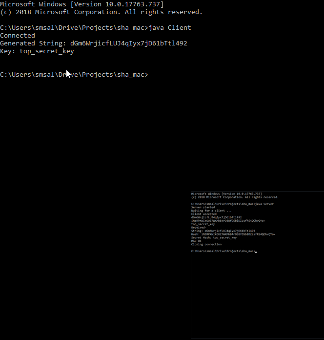
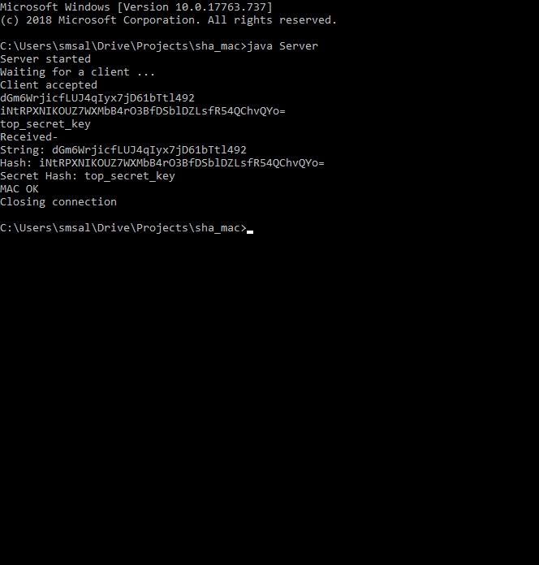
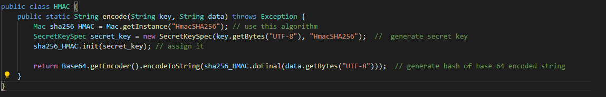

# Output Screenshots

# Key Generation for HMAC-SHA256

For generating the key we first used the appropiate algorithm (in this case it was SHA-256) and then on the basis of the shared private key which given to both client and server we generated HMAC and then represented a 64 Base encoded hash. This hash which was a string was to be exactly the same since both client and server had the secret key and message and could validate that indeed the message was not tampered. 